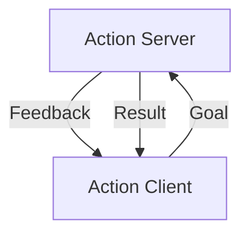

# Action

[Source code](https://github.com/tier4/safe_drive_tutorial/tree/main/action).

An action is a mechanism to request the servers to execute a task while receiving feedback and status along the way. In services there are only a request and its response, but in actions the clients can receive feedback while the server is processing the task. Therefore, actions are suitable for long running tasks.



In this tutorial, we will describe how to implement actions in Rust by using `safe_drive`. 

## Setup

In this tutorial, we prepare 3 Rust projects and a C project.
The following table shows the directories we use.

| Directories               | Description          |
|---------------------------|----------------------|
| action_test/src/server    | server in Rust       |
| action_test/src/client    | client in Rust       |
| action_test/src/actmsg | message type         |

`action_test` is a ROS2's project to define a user defined type for a service we implement.

```text
$ mkdir -p action_test/src
$ cd action_test/src
$ cargo new server
$ cargo new client
$ ros2 pkg create --build-type ament_cmake actmsg
```

In addition to that, create the workspace's `Cargo.toml` as follows.

`action_test/src/Cargo.toml`

```toml
[workspace]
members = [ "client", "server"]
```

## Define Protocol

As example, we create `Counter` action where the client specify how many times the server should count up in the goal, and the server returns the current count as feedback. The server returns the result when the count reaches the goal. 

We have to define the message type for the action in `.action` files as we did for [services](./service.md). Let's create a directory for the action message type:

```text
$ cd action_test/src/actmsg
$ mkdir action
```

### Create `actmsg/action/Counter.action`

Then, create `Counter.action` in which a protocol is specified as follows. 

```text
# Goal definition
uint32 count
---
# Result definition
uint32 last
---
# Feedback definition
uint32 current
```

### Edit `actmsg/CMakeLists.txt`

To generate shared libraries from `Counter.action`, `CMakeLists.txt` must be updated as follows.

```cmake
# action_test/action/actmsg/CMakeLists.txt
find_package(rosidl_default_generators REQUIRED)

rosidl_generate_interfaces(${PROJECT_NAME}
  "action/Counter.action"
)
```

### Edit `actmsg/package.xml`

In addition to that, the following lines must be added to `action_test/src/actmsg/package.xml`:

```xml
<build_depend>rosidl_default_generators</build_depend>
<exec_depend>rosidl_default_runtime</exec_depend>
<member_of_group>rosidl_interface_packages</member_of_group>
```

## Server

A server can be implemented in a straightforward way.

### Edit `server/Cargo.toml`

To generate Rust types from `.srv` files,
we have to edit `Cargo.toml` as follows.

```toml
[dependencies]
safe_drive = "0.4"
actmsg = { path = "/tmp/safe_drive_tutorial/action_test/actmsg" }
tokio = { version = "1", features = ["full"] }

[package.metadata.ros]
msg = ["actmsg"]
msg_dir = "/tmp/safe_drive_tutorial/action_test"
safe_drive_version = "0.4"
```

### Create `server/package.xml`

Now `action_test/src/server` is a Cargo crate. We also have to create `package.xml` there so that it is also recognized as a ROS package.

```xml
<?xml version="1.0"?>
<?xml-model href="http://download.ros.org/schema/package_format3.xsd" schematypens="http://www.w3.org/2001/XMLSchema"?>
<package format="3">
  <name>server</name>
  <version>0.0.0</version>
  <description>action server in Rust</description>
  <maintainer email="john.doe@example.com">John Doe</maintainer>
  <license>Apache License 2.0</license>

  <test_depend>ament_lint_auto</test_depend>
  <test_depend>ament_lint_common</test_depend>

  <depend>actmsg</depend>

  <export>
    <build_type>ament_cargo</build_type>
  </export>
</package>
```

Don't forget to include `<depend>actmsg</depend>`, the package in which the message type definition is located.

## TODO: Generated Types

`Counter.action` is translated into `actmsg/src/action/counter.rs` as follows:

```rust
#[repr(C)]
#[derive(Debug)]
pub struct Counter_Goal {
    pub count: u32,
}

#[repr(C)]
#[derive(Debug, Clone)]
pub struct Counter_Result {
    pub last: u32,
}

#[repr(C)]
#[derive(Debug)]
pub struct Counter_Feedback {
    pub current: u32,
}
```

These structs are incorporated into the helper types for the action server and client.

```rust
#[derive(Debug)]
pub struct Counter;

impl ActionMsg for Counter {
    type Goal = Counter_SendGoal;
    type Result = Counter_GetResult;
    type Feedback = Counter_FeedbackMessage;

    ...

    type GoalContent = Counter_Goal;
    type ResultContent = Counter_Result;
    type FeedbackContent = Counter_Feedback;
}

#[repr(C)]
#[derive(Debug)]
pub struct Counter_SendGoal_Request {
    pub goal_id: unique_identifier_msgs::msg::UUID,
    pub goal: Counter_Goal,
}
```

### Edit `server/src/main.rs`

You have to create a server by `create_server()` method and register a callback function to a selector as follows.

```rust
use safe_drive::{
    self,
    action::{
        handle::GoalHandle,
        server::{AsyncServer, Server, ServerCancelSend, ServerGoalSend, ServerQosOption},
    },
    context::Context,
    error::DynError,
};
use std::{sync::Arc, time::Duration};
use actmsg::action::{Counter, Counter_Feedback, Counter_Result, Counter_SendGoal_Request};

fn create_server(
    ctx: &Arc<Context>,
    node: &str,
    action: &str,
    qos: Option<ServerQosOption>,
) -> Result<Server<Counter>, DynError> {
    let node_server = ctx.create_node(node, None, Default::default()).unwrap();

    Server::new(node_server, action, qos).map_err(|e| e.into())
}

fn spawn_worker(goal: u32, handle: GoalHandle<Counter>) {
    std::thread::Builder::new()
        .name("worker".into())
        .spawn(move || {
            for count in 0..=goal {
                if handle.is_canceling().unwrap() {
                    println!("server worker: canceling the goal");
                    handle.canceled(Counter_Result { last: count }).unwrap();
                    return;
                }

                println!("server worker: sending feedback {count}");
                let feedback = Counter_Feedback { current: count };
                handle.feedback(feedback).unwrap();
                std::thread::sleep(Duration::from_secs(1));
            }

            println!("server worker: result is now available");
            handle.finish(Counter_Result { last: 10 }).unwrap();
        })
        .unwrap();
}

async fn run_server(server: Server<Counter>) -> Result<(), DynError> {
    let mut server = AsyncServer::new(server);

    let goal = move |sender: ServerGoalSend<Counter>, req: Counter_SendGoal_Request| {
        println!("server: goal received: {:?}", req.goal);

        let s = sender
            .accept(|handle| spawn_worker(req.goal.count, handle))
            .map_err(|(_sender, err)| err)
            .expect("could not accept");
        // let s = sender.reject().map_err(|(_sender, err)| err)?;

        println!("server: goal response sent");

        s
    };

    let cancel = move |sender: ServerCancelSend<Counter>, candidates| {
        println!("server: received cancel request for: {:?}", candidates);

        let accepted = candidates; // filter requests here if needed

        // return cancel response
        let s = sender
            .send(accepted)
            .map_err(|(_s, err)| err)
            .expect("could not send cancel response");

        // perform shutdown operations for the goals here if needed

        println!("server: cancel response sent");

        s
    };

    server.listen(goal, cancel).await
}

#[tokio::main]
async fn main() -> Result<(), DynError> {
    let ctx = Context::new()?;
    let server = create_server(
        &ctx,
        "safe_drive_example_action_server",
        "safe_drive_example",
        None,
    )?;

    run_server(server).await
}
```

`run_server()` defines two handlers for the goal and cancel requests. The goal request handler spawns a worker thread that sends feedbacks and finishes the goal when the count reaches the goal. The cancel request handler sends a cancel response to the client. This action server always accepts the goal and the cancel requests.

## Client


### Edit `client/Cargo.toml`

`safe_drive`, and `tokio` must be added to `action_test/src/client/Cargo.toml`:

```toml
[package]
...

[dependencies]
safe_drive = "0.4"
actmsg = { path = "/tmp/safe_drive_tutorial/action_test/actmsg" }
tokio = { version = "1", features = ["full"] }
rand = "0.8"

[package.metadata.ros]
msg = ["actmsg"]
msg_dir = "/tmp/safe_drive_tutorial/action_test"
safe_drive_version = "0.4"
```

### Create `client/package.xml`

`package.xml` is also required as follows.

`action_test/src/client/package.xml`

```xml
<?xml version="1.0"?>
<?xml-model href="http://download.ros.org/schema/package_format3.xsd" schematypens="http://www.w3.org/2001/XMLSchema"?>
<package format="3">
  <name>client</name>
  <version>0.0.0</version>
  <description>Client in Rust</description>
  <maintainer email="john.doe@example.com">John Doe</maintainer>
  <license>Apache License 2.0</license>

  <test_depend>ament_lint_auto</test_depend>
  <test_depend>ament_lint_common</test_depend>

  <depend>actmsg</depend>

  <export>
    <build_type>ament_cargo</build_type>
  </export>
</package>
```

Don't forget to include `<depend>actmsg</depend>`.

### Edit `client/src/main.rs`

We recommend to use async/await to implement a client,
because a client wait a response, but when the response is replied is unpredictable.
In this tutorial, we use [Tokio](https://tokio.rs/), which is the most popular asynchronous library of Rust.

```rust
use safe_drive::{
    self,
    action::client::Client,
    context::Context,
    error::DynError,
    msg::unique_identifier_msgs::msg::UUID,
};
use std::{sync::Arc, thread, time::Duration};

use actmsg::action::{Counter, Counter_GetResult_Request, Counter_Goal};

fn create_client(
    ctx: &Arc<Context>,
    node: &str,
    action: &str,
) -> Result<Client<Counter>, DynError> {
    let node_client = ctx.create_node(node, None, Default::default())?;
    Client::new(node_client, action, None).map_err(|e| e.into())
}

#[tokio::main]
async fn main() -> Result<(), DynError> {
    let ctx = Context::new()?;
    let client = create_client(
        &ctx,
        "safe_drive_example_action_client",
        "safe_drive_example",
    )?;

    // send a goal request
    let uuid: [u8; 16] = rand::random();
    let goal = Counter_Goal { count: 10 };
    let receiver = client.send_goal_with_uuid(goal, uuid)?;

    // receive a goal response
    let recv = receiver.recv();
    let client = match tokio::time::timeout(Duration::from_secs(10), recv).await {
        Ok(Ok((c, response, _header))) => {
            println!("client: goal response received: {:?}", response);
            c
        }
        Ok(Err(e)) => panic!("{e:?}"),
        Err(_) => panic!("timed out"),
    };

    thread::sleep(Duration::from_secs(1));

    // receive feedback
    let mut client = client;
    loop {
        let recv = client.recv_feedback();
        client = match tokio::time::timeout(Duration::from_secs(3), recv).await {
            Ok(Ok((c, feedback))) => {
                println!("client: feedback received: {:?}", feedback);

                if feedback.feedback.current == 5 {
                    client = c;
                    break;
                }
                c
            }
            Ok(Err(e)) => panic!("{e:?}"),
            Err(_) => panic!("timed out"),
        };
    }

    // send a result request
    println!("sending result request...");
    let receiver = client.send_result_request(&Counter_GetResult_Request {
        goal_id: UUID { uuid },
    })?;
    let recv = receiver.recv();

    let _ = match recv.await {
        Ok((c, response, _header)) => {
            println!("client: result response received: {:?}", response);
            c
        }
        Err(e) => panic!("{e:?}"),
    };

    Ok(())
}
```

The client sends a goal request and receives a goal response. Then, it receives feedbacks until the count reaches 5. After that, it sends a result request and receives a result response.

## Execution

Compile the project and execute a server as follows.

```text
$ cd action_test
$ colcon build --cargo-args --release
$ . ./install/setup.bash
$ ros2 run server server
```

Then, in another terminal, execute a client as follows.

```text
$ cd action_test
$ . ./install/setup.bash
$ ros2 run client client
```

You will see the following output in the server terminal:

```text
$ ros2 run server server
server: goal received: Counter_Goal { count: 10 }
server: goal response sent
server worker: sending feedback 0
server worker: sending feedback 1
server worker: sending feedback 2
server worker: sending feedback 3
server worker: sending feedback 4
server worker: sending feedback 5
server worker: sending feedback 6
server worker: sending feedback 7
server worker: sending feedback 8
server worker: sending feedback 9
server worker: sending feedback 10
server worker: result is now available
```

And you will see the following in the client terminal:

```text
$ ros2 run client
action_name: safe_drive_example
action_name: safe_drive_example
client: goal response received: Counter_SendGoal_Response { accepted: true, stamp: builtin_interfaces__msg__Time { sec: 1725359459, nanosec: 311260110 } }
client: feedback received: Counter_FeedbackMessage { goal_id: UUID { uuid: [77, 80, 117, 146, 120, 67, 211, 56, 145, 192, 92, 104, 24, 206, 155, 33] }, feedback: Counter_Feedback { current: 0 } }
client: feedback received: Counter_FeedbackMessage { goal_id: UUID { uuid: [77, 80, 117, 146, 120, 67, 211, 56, 145, 192, 92, 104, 24, 206, 155, 33] }, feedback: Counter_Feedback { current: 1 } }
client: feedback received: Counter_FeedbackMessage { goal_id: UUID { uuid: [77, 80, 117, 146, 120, 67, 211, 56, 145, 192, 92, 104, 24, 206, 155, 33] }, feedback: Counter_Feedback { current: 2 } }
client: feedback received: Counter_FeedbackMessage { goal_id: UUID { uuid: [77, 80, 117, 146, 120, 67, 211, 56, 145, 192, 92, 104, 24, 206, 155, 33] }, feedback: Counter_Feedback { current: 3 } }
client: feedback received: Counter_FeedbackMessage { goal_id: UUID { uuid: [77, 80, 117, 146, 120, 67, 211, 56, 145, 192, 92, 104, 24, 206, 155, 33] }, feedback: Counter_Feedback { current: 4 } }
client: feedback received: Counter_FeedbackMessage { goal_id: UUID { uuid: [77, 80, 117, 146, 120, 67, 211, 56, 145, 192, 92, 104, 24, 206, 155, 33] }, feedback: Counter_Feedback { current: 5 } }
sending result request...
client: result response received: Counter_GetResult_Response { status: 4, result: Counter_Result { last: 10 } }
```


Nice! You have implemented an action server and client in Rust.

If you are familiar with ROS 2 actions, you might wonder how to cancel the goal or take the status. Here we did not describe but you can refer `tests/async_actions.rs` to see how it is done.