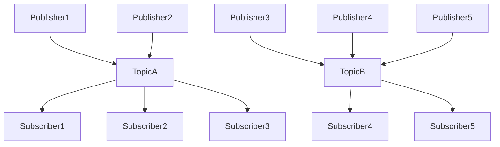
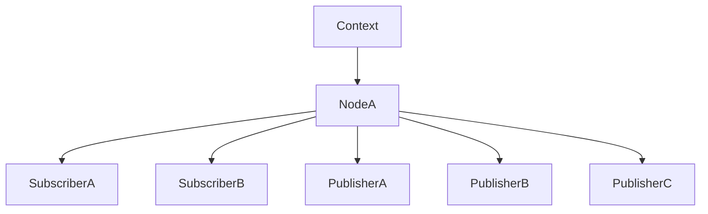

# Publish and Subscribe

[Source code](https://github.com/tier4/safe_drive_tutorial/tree/main/pubsub).

This chapter introduces a simple example of publish and subscribe communication.
This communication is so-called topic by ROS2.
There are `N` senders and `M` receivers in a topic.
This tutorial implements 1 sender (in Rust) and 2 receivers (in Rust and C++).

The following figure is a example topology.



There are 2 topics, `TopicA` and `TopicB` in this figure.
If `Publisher2` of `TopicA` send a message,
`Subscriber1-3` subscribing `TopicA` receive the message.
`Subscriber4` and `Subscriber5` can receive messages sent from
`Publisher3-5`.

## Directories

First of all, create working directories as follows.

```text
$ mkdir pubsub
$ mkdir pubsub/src
```

Then create projects of Rust by using `cargo` as follows.

```text
$ cd pubsub/src
$ cargo new my_talker
$ cargo new my_listener
```

Following directories are important directories
we will use throughout this tutorial.

| Directories            | What?              |
|------------------------|--------------------|
| pubsub/src/my_talker   | publisher in Rust  |
| pubsub/src/my_listener | subscriber in Rust |
| pubsub/install         | created by colcon  |

## Workspace of Rust

To handle multiple projects of `cargo`, we recommend to prepare `Cargo.toml` for the workspace as follows.

`pubsub/src/Cargo.toml`

```toml
[workspace]
members = ["my_talker", "my_listener"]
```

The workspace enables `rust-analyzer` and reduces compilation time.

---

## Talker in Rust

Let's start implementing a publisher.
We created and will edit files of the talker as follows.
These files will automatically created when you do `cargo new` as described before.

| Files                 | What?       |
|-----------------------|-------------|
| my_talker/Cargo.toml  | for Cargo   |
| my_talker/package.xml | for ROS2    |
| my_talker/src/main.rs | source code |

### Edit `my_talker/Cargo.toml`

`Cargo.toml` is used to describe a project of Rust.
Add safe_drive to the dependencies of `Cargo.toml` to use it.
Currently, safe_drive's repository is private,
and we need to specify the path as follows.

`pubsub/src/my_talker/Cargo.toml`

```toml
[dependencies]
safe_drive = "0.2"
std_msgs = { path = "/tmp/safe_drive_tutorial/pubsub/std_msgs" }

[package.metadata.ros]
msg = ["std_msgs"]
msg_dir = "/tmp/safe_drive_tutorial/pubsub"
safe_drive_version = "0.2"
```

### Edit `my_talker/src/main.rs`

my_talker is very simple.
This does as follows.

1. Create a context.
1. Create a node from the context.
1. Create a publisher from the node.
1. Send a message periodically.

A context is a resource manager of ROS2,
and it must be created first of all.
A node contains publishers, subscribers, servers, and clients.
A node is a functional unit of ROS2.
Publishers and subscribers can be created by a node.

The following figure is an example hierarchy.



In this figure, `NodeA` is created by a context,
and subscribers and publishers are created by the node.

Now, we have understood the basics of ROS2.
The following is a code of my_talker.
You should also understand what this code is doing.

`pubsub/src/my_talker/src/main.rs`

```rust
use safe_drive::{
    context::Context, error::DynError, logger::Logger, pr_info
};
use std::time::Duration;

fn main() -> Result<(), DynError> {
    // Create a context.
    let ctx = Context::new()?;

    // Create a node.
    let node = ctx.create_node("my_talker", None, Default::default())?;

    // Create a publisher.
    let publisher = node.create_publisher::<std_msgs::msg::String>("my_topic", None)?;

    // Create a logger.
    let logger = Logger::new("my_talker");

    let mut cnt = 0; // Counter.
    let mut msg = std_msgs::msg::String::new().unwrap();
    loop {
        // Create a message to be sent.
        let data = format!("Hello, World!: cnt = {cnt}");
        msg.data.assign(&data);

        pr_info!(logger, "send: {}", msg.data); // Print log.

        // Send a message.
        publisher.send(&msg)?;

        // Sleep 1s.
        cnt += 1;
        std::thread::sleep(Duration::from_secs(1));
    }
}
```

#### my_talker in Detail

`create_node` creates a node.

```rust
// Create a node.
let node = ctx.create_node("my_talker", None, Default::default())?;
```

The arguments indicate as follows.

- `"my_talker"` : the name of the node.
- Node : namespace.
  - We can pass a namespace like `Some("namespace")`.
  - If `None` is passed, the node has no namespace.
- `Default::default()` : option of node.

`create_publisher` creates a publisher.

```rust
// Create a publisher.
let publisher = node.create_publisher::<std_msgs::msg::String>("my_topic", None)?;
```

- `<std_msgs::msg::String>` : the publisher can send values of `std_msgs::msg::String`.
- `"my_topic"` : the topic name to which the publisher send messages.
- `None` : QoS of the publisher. QoS will be described in a later chapter.

A message can be sent by `send` method as follows.

```rust
// Create a message to be sent.
let data = format!("Hello, World!: cnt = {cnt}");
msg.data.assign(&data);

// Send a message.
publisher.send(&msg)?;
```

`Logger` is used to print some messages.
It can be created as follows.

```rust
// Create a logger.
let logger = Logger::new("my_talker");
```

The argument of `"my_talker"` is the name of the logger.
To print a message, use `pr_*` macros as follows.

```rust
pr_info!(logger, "send: {}", msg.data); // Print log.
```

There are macros for logging as follows.

- `pr_debug!` : debug
- `pr_info!` : information
- `pr_warn!` : warning
- `pr_err!` : error
- `pr_fatal!` : fatal


### Create `my_talker/package.xml`

`package.xml` is used by colcon, which is a build tool used by ROS2.
It contains the package name, maintainer, description, etc, as follows.

`pubsub/src/my_talker/package.xml`

```xml
<?xml version="1.0"?>
<?xml-model href="http://download.ros.org/schema/package_format3.xsd" schematypens="http://www.w3.org/2001/XMLSchema"?>
<package format="3">
  <name>my_talker</name>
  <version>0.0.0</version>
  <description>My Talker in Rust</description>
  <maintainer email="yuuki.takano@tier4.jp">Yuuki Takano</maintainer>
  <license>Apache License 2.0</license>

  <depend>std_msgs</depend>

  <test_depend>ament_lint_auto</test_depend>
  <test_depend>ament_lint_common</test_depend>

  <export>
    <build_type>ament_cargo</build_type>
  </export>
</package>
```

Copy and paste this, then edit it if you want.

### Execute the Talker

Before compiling, ensure that you load setting of ROS2 as follows.
If you have already done so, you do not need this.

```text
$ . /opt/ros/humble/setup.bash
```

Then compile by using colcon as follows.
Before compiling, change the current directory to `pubsub`,
which is the top directory of our project.

```text
$ cd pubsub
$ colcon build --cargo-args --release
```

`--cargo-args --release` is a option to pass the `--release` argument to `cargo`.
`cargo` optimizes the code when `--release` is specified.

To launch `my_talker`,
load the setting and use `ros2` command as follows.

```text
$ . ./install/setup.bash
$ ros2 run my_talker my_talker
[INFO] [1656048392.368568500] [my_talker]: send: Hello, World!: cnt = 0
[INFO] [1656048393.368787500] [my_talker]: send: Hello, World!: cnt = 1
[INFO] [1656048394.368994200] [my_talker]: send: Hello, World!: cnt = 2
```

---

## Listener in Rust

Let's then implement a listener.
We created and will edit files of the listener as follows.

| Files                   | What?       |
|-------------------------|-------------|
| my_listener/Cargo.toml  | for Cargo   |
| my_listener/package.xml | for ROS2    |
| my_listener/src/main.rs | source code |

### Edit `my_listener/Cargo.toml`

`my_listener` also requires safe_drive.
Add safe_drive to the dependencies as follows.

```toml
# pubsub/src/my_listener/Cargo.toml
[dependencies]
safe_drive = "0.2"
std_msgs = { path = "/tmp/safe_drive_tutorial/pubsub/std_msgs" }

[package.metadata.ros]
msg = ["std_msgs"]
msg_dir = "/tmp/safe_drive_tutorial/pubsub"
safe_drive_version = "0.2"
```

### Edit `my_listener/src/main.rs`

To implement subscriber,
we have to prepare a callback function of the subscriber.
This is the main difference from `my_talker`.

`pubsub/src/my_listener/src/main.rs`

```rust
use safe_drive::{
    context::Context, error::DynError, logger::Logger, pr_info,
};

fn main() -> Result<(), DynError> {
    // Create a context.
    let ctx = Context::new()?;

    // Create a node.
    let node = ctx.create_node("my_listener", None, Default::default())?;

    // Create a subscriber.
    let subscriber = node.create_subscriber::<std_msgs::msg::String>("my_topic", None)?;

    // Create a logger.
    let logger = Logger::new("my_listener");

    // Create a selector.
    let mut selector = ctx.create_selector()?;

    // Add a callback function.
    selector.add_subscriber(
        subscriber,
        Box::new(move |msg| {
            pr_info!(logger, "receive: {}", msg.data);
        }),
    );

    // Spin.
    loop {
        selector.wait()?;
    }
}
```

#### `my_listener` in Detail

Similar to the publisher,
`create_subscriber` creates a subscriber.

```rust
// Create a subscriber.
let subscriber = node.create_subscriber::<std_msgs::msg::String>("my_topic", None)?;
```

The arguments are as follows.

- `"my_topic"` : the name of the topic to which the subscriber is subscribing.
- `None` : QoS of the subscriber. Discussed in a later chapter.

To add and invoke a callback function.
We need to create a selector,
which can wait some events and invoke callback functions of the events.
A selector is similar to `select` or `epoll` function,
and equivalent to a executer of ROS2.

```rust
// Create a selector.
let mut selector = ctx.create_selector()?;

// Add a callback function.
selector.add_subscriber(
    subscriber,
    Box::new(move |msg| {
        pr_info!(logger, "receive: {}", msg.data);
    }),
);

// Spin.
loop {
    selector.wait()?;
}
```

The arguments of `add_subscriber` method are as follows.

- `subscriber` : the subscriber.
-  `Box::new(move |msg| { pr_info!(logger, "receive: {}", msg.data); })` : the callback function.
- `false` : the callback function is called only once or not. If `false` is passed, the callback function is invoked every time and forever.

`selector.wait()` wait events.
To receive events forever, use infinite loop.

### Create `my_listener/package.xml`

`package.xml` is almost same as above.
The only difference is the name of the package,
which is `my_listener`.

`pubsub/src/my_listener/package.xml`

```xml
<?xml version="1.0"?>
<?xml-model href="http://download.ros.org/schema/package_format3.xsd" schematypens="http://www.w3.org/2001/XMLSchema"?>
<package format="3">
  <name>my_listener</name>
  <version>0.0.0</version>
  <description>My Listener in Rust</description>
  <maintainer email="yuuki.takano@tier4.jp">Yuuki Takano</maintainer>
  <license>Apache License 2.0</license>

  <depend>std_msgs</depend>

  <test_depend>ament_lint_auto</test_depend>
  <test_depend>ament_lint_common</test_depend>

  <export>
    <build_type>ament_cargo</build_type>
  </export>
</package>
```

### Execute the Listener

Before compiling and executing, execute `my_talker` in other terminal,
and don't forget to load the setting of ROS2 as mentioned above.
The compilation can be done as follows.

```text
$ cd pubsub
$ colcon build --cargo-args --release
```

To execute `my_listener`, load the setting of our projects and
execute it by using `ros2` command as follows.

```text
$ . ./install/setup.bash
$ ros2 run my_talker my_talker
[INFO] [1656050459.231579900] [my_listener]: receive: Hello, World!: cnt = 4
[INFO] [1656050460.231831200] [my_listener]: receive: Hello, World!: cnt = 5
[INFO] [1656050461.232120000] [my_listener]: receive: Hello, World!: cnt = 6
```

Nicely done!
We are receiving messages sent from `my_talker`.
