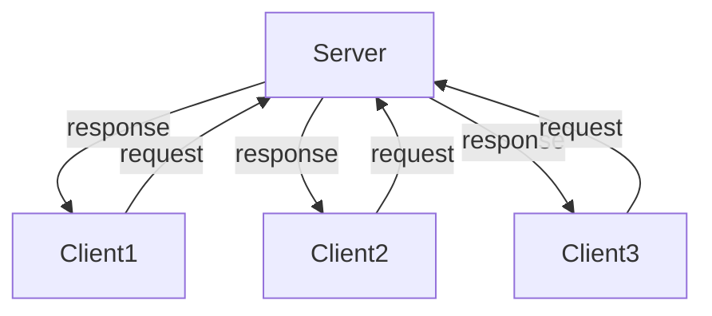

# Service

[Source code](https://github.com/tier4/safe_drive_tutorial/tree/main/srvtest).

A service is a communication consisting requests and responses.
There are a server and clients for a service as follows.



A client sends a request and the server replies the request.
In this tutorial, we will describe how to implement a client and a server in Rust by using `safe_drive`.

## Create Base Files

In this tutorial, we prepare 3 Rust's projects and 1 C's project.
The following table shows the directories we use.

| Directories           | Description          |
|-----------------------|----------------------|
| srvtest/src/server    | server in Rust       |
| srvtest/src/client    | client in Rust       |
| srvtest/src/srvmsg    | message type         |

`srvmsg` is a ROS2's project to define a user defined type for a service we implement.

```text
$ mkdir -p srvtest/src
$ cd srvtest/src
$ cargo new server
$ cargo new client
$ ros2 pkg create --build-type ament_cmake srvmsg
```

In addition to that, create the workspace's `Cargo.toml` as follows.

`srvtest/src/Cargo.toml`

```toml
[workspace]
members = [ "client", "server"]
```

## Define Protocol

First of all, let's define a protocol for a service.
ROS2 provides a special format to define a protocol,
and it should be described in a `.srv` file.

Usually, `.srv` files are placed in a `srv` directory.
So, we create `srv` directory as follows.

```text
$ cd srvtest/src/srvmsg
$ mkdir srv
```

### Create `srvmsg/srv/AddTwoInts.srv`

Then, create `AddTwoInts.srv` file in which a protocol is specified as follows.

```text
uint32 x
uint32 y
---
uint32 result
```

`uint32 x` and `uint32 y` above `--` are types which must be
included in a request, and `uint32 result` is a type which must be
included in a response.
We will implement a server which takes 2 integer values
and returns the summation of the values.

### Edit `srvmsg/CMakeLists.txt`

To generate shared libraries from `AddTwoInts.srv`,
`CMakeLists.txt` must be updated as follows.

```cmake
# srvtest/src/srvmsg/CMakeLists.txt
find_package(rosidl_default_generators REQUIRED)

rosidl_generate_interfaces(${PROJECT_NAME}
  "srv/AddTwoInts.srv"
)
```

### Edit `srvmsg/package.xml`

In addition to that, the following lines must be added to `package.xml`.

`srvtest/src/srvmsg/package.xml`

```xml
<build_depend>rosidl_default_generators</build_depend>
<exec_depend>rosidl_default_runtime</exec_depend>
<member_of_group>rosidl_interface_packages</member_of_group>
```

## Server

A server can be implemented in a straightforward way.

### Edit `server/Cargo.toml`

To generate Rust types from `.srv` files,
we have to edit `Cargo.toml` as follows.

```toml
[dependencies]
safe_drive = "0.2"
srvmsg = { path = "/tmp/safe_drive_tutorial/srvtest/srvmsg" }
tokio = { version = "1", features = ["full"] }

[package.metadata.ros]
msg = ["srvmsg"]
msg_dir = "/tmp/safe_drive_tutorial/srvtest"
safe_drive_version = "0.2"
```

### Create `server/package.xml`

`package.xml` is also required as follows.

`srvtest/src/server/package.xml`

```xml
<?xml version="1.0"?>
<?xml-model href="http://download.ros.org/schema/package_format3.xsd" schematypens="http://www.w3.org/2001/XMLSchema"?>
<package format="3">
  <name>server</name>
  <version>0.0.0</version>
  <description>Server in Rust</description>
  <maintainer email="yuuki.takano@tier4.jp">Yuuki Takano</maintainer>
  <license>Apache License 2.0</license>

  <test_depend>ament_lint_auto</test_depend>
  <test_depend>ament_lint_common</test_depend>

  <depend>srvmsg</depend>

  <export>
    <build_type>ament_cargo</build_type>
  </export>
</package>
```

Don't forget `<depend>srvmsg</depend>`.

## Generate Types

`AddTwoInts.srv` will be translated to `struct AddTwoInts` as follows.

```rust
#[derive(Debug)]
pub struct AddTwoInts;

impl ServiceMsg for AddTwoInts {
    type Request = AddTwoInts_Request;
    type Response = AddTwoInts_Response;
    fn type_support() -> *const rcl::rosidl_service_type_support_t {
        unsafe {
            rosidl_typesupport_c__get_service_type_support_handle__srvmsg__srv__AddTwoInts()
        }
    }
}
```

`struct AddTwoInts` implements `ServiceMsg trait`.
`ServiceMsg::Request` and `ServiceMsg::Response` are types of request and response, respectively.
`AddTwoInts_Request` and `AddTowInts_Response` are as follows.

```rust
#[repr(C)]
#[derive(Debug)]
pub struct AddTwoInts_Request {
    pub x: u32,
    pub y: u32,
}

#[repr(C)]
#[derive(Debug)]
pub struct AddTwoInts_Response {
    pub result: u32,
}
```

### Edit `server/src/main.rs`

You have to create a server by `create_server()` method and register a callback function to a selector as follows.

```rust
use safe_drive::{context::Context, error::DynError, logger::Logger, pr_error, qos::Profile};
use srvmsg_rs::srvmsg::srv::{AddTwoInts, AddTwoInts_Response};

fn main() -> Result<(), DynError> {
    // Create a context.
    let ctx = Context::new()?;

    // Create a node.
    let node = ctx.create_node("server_node", None, Default::default())?;

    // Create a server.
    let server = node.create_server::<AddTwoInts>("my_service", Some(Profile::default()))?;

    // Create a selector.
    let mut selector = ctx.create_selector()?;

    // Create a logger.
    let logger = Logger::new("server");

    selector.add_server(
        server,
        Box::new(move |msg, _header| {
            let mut response = AddTwoInts_Response::new().unwrap();
            pr_error!(logger, "recv: {:?}", msg);
            response.result = msg.x + msg.y;
            response
        }),
    );

    loop {
        selector.wait()?; // Spin.
    }
}
```

Let's dig into detail.

```rust
// Create a server.
let server = node.create_server::<AddTwoInts>("my_service", Some(Profile::default()))?;
```

`AddTwoInts` of `create_server::<AddTwoInts>` indicates the protocol of the server.
The arguments of `"my_service"` and `Some(Profile::default())` are the service name and QoS.
If you pass `None` instead of `Some(Profile::default())`, `Profile::default()` is used.

The callback was passed as follows.

```rust
selector.add_server(
    server,
    Box::new(move |msg, _header| {
        let mut response = AddTwoInts_Response::new().unwrap();
        pr_error!(logger, "recv: {:?}", msg);
        response.result = msg.x + msg.y;
        response
    }),
);
```

The callback function must take a message sent by a client and a header including sequence number, time, etc.
`msg`'s types is `AddTwoInts_Request` and a value of `AddTwoInts_Response`, which is a response, must be returned.

## Client


### Edit `client/Cargo.toml`

`safe_drive`, and `tokio` must be added to `Cargo.toml` as follows.

`srvtest/src/client/Cargo.toml`

```toml
[dependencies]
safe_drive = "0.2"
srvmsg = { path = "/tmp/safe_drive_tutorial/srvtest/srvmsg" }
tokio = { version = "1", features = ["full"] }

[package.metadata.ros]
msg = ["srvmsg"]
msg_dir = "/tmp/safe_drive_tutorial/srvtest"
safe_drive_version = "0.1"
```

### Create `client/package.xml`

`package.xml` is also required as follows.

`srvtest/src/client/package.xml`

```xml
<?xml version="1.0"?>
<?xml-model href="http://download.ros.org/schema/package_format3.xsd" schematypens="http://www.w3.org/2001/XMLSchema"?>
<package format="3">
  <name>client</name>
  <version>0.0.0</version>
  <description>Client in Rust</description>
  <maintainer email="yuuki.takano@tier4.jp">Yuuki Takano</maintainer>
  <license>Apache License 2.0</license>

  <test_depend>ament_lint_auto</test_depend>
  <test_depend>ament_lint_common</test_depend>

  <depend>srvmsg</depend>

  <export>
    <build_type>ament_cargo</build_type>
  </export>
</package>
```

Don't forget `<depend>srvmsg</depend>`.

### Edit `client/src/main.rs`

We recommend to use async/await to implement a client,
because a client wait a response, but when the response is replied is unpredictable.
In this tutorial, we use [Tokio](https://tokio.rs/), which is the most popular asynchronous library of Rust.

```rust
use safe_drive::{
    context::Context, error::DynError, logger::Logger, pr_error, pr_info, pr_warn, qos::Profile,
};
use srvmsg_rs::srvmsg::srv::{AddTwoInts, AddTwoInts_Request};
use std::time::Duration;
use tokio::time::timeout;

#[tokio::main]
async fn main() -> Result<(), DynError> {
    // Create a context and a node.
    let ctx = Context::new()?;
    let node = ctx.create_node("client", None, Default::default())?;

    let logger = Logger::new("client");

    // Create a client.
    let mut client = node.create_client::<AddTwoInts>("my_service", Some(Profile::default()))?;

    let mut n = 0;
    loop {
        let mut request = AddTwoInts_Request::new().unwrap();
        request.x = n;
        request.y = n + 1;
        n += 1;

        // Send a request.
        let client_rcv = client.send(&request)?;

        // Receive a request.
        let mut receiver = client_rcv.recv();

        match timeout(Duration::from_secs(1), &mut receiver).await {
            Ok(Ok((c, response, _header))) => {
                pr_info!(logger, "received {:?}", response);
                client = c;
            }
            Ok(Err(e)) => {
                pr_error!(logger, "error: {e}");
                return Err(e);
            }
            Err(elapsed) => {
                pr_warn!(logger, "timeout: {elapsed}");
                client = receiver.give_up();
            }
        }

        tokio::time::sleep(Duration::from_secs(1)).await;
    }
}
```

Because a response will be never returned,
we use `tokio::time::timeout` to receive a response.
`timeout(Duration::from_secs(1), &mut receiver).await`
takes a duration and a awaitable future.
The awaitable future can be taken by `client_rcv.recv()`.

Note that it uses `tokio::time::sleep` instead of
`std::thread::sleep` because to avoid calling blocking functions.

`client.send()` consumes `client` and it returns `client_recv`
to receive a response.
`client_rcv.recv()` consumes  `client_recv` and `client_rcv.recv().await`
returns new client, a response, and a header.
The new client must be used to send next request.

This means that you cannot ignore receiving a response.
If you forget to receive a response,
you cannot send any request again,
because you need to get a new client by receiving a response..
Otherwise, you encountered compilation errors.

## Execution

First of all, you have to compile it and execute a server as follows.

```text
$ cd srvtest
$ colcon build --cargo-args --release
$ . ./install/setup.bash
$ ros2 run server server
```

Then, in another terminal, execute a client as follows.

```text
$ cd srvtest
$ . ./install/setup.bash
$ ros2 run client client
[WARN] [1659604527.720730018] [client]: timeout: deadline has elapsed
[INFO] [1659604528.722220697] [client]: received AddTwoInts_Response { result: 3 }
[INFO] [1659604529.723525686] [client]: received AddTwoInts_Response { result: 5 }
[INFO] [1659604530.724820326] [client]: received AddTwoInts_Response { result: 7 }
```

Nicely done!
We used async/await for the client,
and it can be used for the server as follows.

```rust
async { server.recv().await };
```
