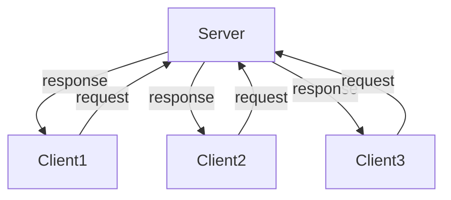

# Service

A service is a communication consisting requests and responses.
There are a server and clients for a service as follows.



A client sends a request and the server replies the request.
In this tutorial, we will describe how to implement a client and a server in Rust by using `safe_drive`.

## Create Base Files

In this tutorial, we prepare 3 Rust's projects and 1 C's project.
The following table shows the directories we use.

| Directories           | Description          |
|-----------------------|----------------------|
| srvtest/src/server    | server in Rust       |
| srvtest/src/client    | client in Rust       |
| srvtest/src/srvmsg    | message type         |
| srvtest/src/srvmsg_rs | message type in Rust |

`srvmsg` is a ROS2's project to define a user defined type for a service we implement. So, some `srvmsg_rs`'s files will be generated by using `ros2msg_to_rs` as described previously. These directories can be created as follows.

```text
$ mkdir -p srvtest/src
$ cd srvtest/src
$ cargo new server
$ cargo new client
$ cargo new --lib srvmsg_rs
$ ros2 pkg create --build-type ament_cmake srvmsg
```

## Define Protocol

First of all, let's define a protocol for a service.
ROS2 provides a special format to define a protocol,
and it should be described in a `.srv` file.

Usually, `.srv` files are placed in a `srv` directory.
So, we create `.srv` directory as follows.

```text
$ cd srvtest/src/srvmsg
$ mkdir srv
```

### Create `srvmsg/srv/AddTwoInts.srv`

Then, create `AddTwoInts.srv` file in which a protocol is specified as follows.

```text
uint32 x
uint32 y
---
uint32 result
```

`uint32 x` and `uint32 y` above `--` are types which must be
included in a request, and `uint32 result` is a type which must be
included in a response.
We will implement a server which takes 2 integer values
and returns the summation of the values.

### Edit `srvmsg/CMakeLists.txt`

To generate shared libraries from `AddTwoInts.srv`,
`CMakeLists.txt` must be updated as follows.

```cmake
# srvtest/src/srvmsg/CMakeLists.txt
find_package(rosidl_default_generators REQUIRED)

rosidl_generate_interfaces(${PROJECT_NAME}
  "srv/AddTwoInts.srv"
)
```

### Edit `srvmsg/package.xml`

In addition to that, the following lines must be added to `package.xml`.

```xml
<!-- srvtest/src/srvmsg/package.xml -->
<build_depend>rosidl_default_generators</build_depend>

<exec_depend>rosidl_default_runtime</exec_depend>

<member_of_group>rosidl_interface_packages</member_of_group>
```

## Generate Protocol Type for Rust

```text
$ cd srvtest/src
$ ros2msg_to_rs  -i ./ -o ./srvmsg_rs/src
generating: ./srvmsg_rs/src/srvmsg/srv/add_two_ints.rs
generating: ./srvmsg_rs/src/srvmsg/srv.rs
generating: ./srvmsg_rs/src/mod.rs
generating: ./srvmsg_rs/src/srvmsg/mod.rs
```

```rust
pub struct AddTwoInts;

impl ServiceMsg for AddTwoInts {
    type Request = AddTwoIntsRequest;
    type Response = AddTwoIntsResponse;
    fn type_support() -> *const rcl::rosidl_service_type_support_t {
        unsafe {
            rosidl_typesupport_c__get_service_type_support_handle__srvmsg__srv__AddTwoInts()
        }
    }
}
```

```rust
#[repr(C)]
#[derive(Debug)]
pub struct AddTwoIntsRequest {
    pub x: u32,
    pub y: u32,
}

#[repr(C)]
#[derive(Debug)]
pub struct AddTwoIntsResponse {
    pub result: u32,
}
```

### Edit `srvmsg_rs/src/lib.rs`

```rust
// srvtest/src/srvmsg_rs/src/lib.rs
#![allow(dead_code)]
#![allow(non_upper_case_globals)]
#![allow(non_camel_case_types)]
#![allow(deref_nullptr)]
#![allow(non_snake_case)]
#![allow(improper_ctypes)]
#![allow(unused_imports)]
#![allow(clippy::upper_case_acronyms)]
#![allow(clippy::too_many_arguments)]

pub mod srvmsg;
```

```toml
# srvtest/src/srvmsg_rs/Cargo.toml
[dependencies]
safe_drive = { path = "/root/safe_drive" }
```

```rust
// srvtest/src/srvmsg_rs/build.rs
fn main() {
    println!("cargo:rustc-link-lib=srvmsg__rosidl_generator_c");
    println!("cargo:rustc-link-lib=srvmsg__rosidl_typesupport_c");

    if let Some(e) = std::env::var_os("AMENT_PREFIX_PATH") {
        let env = e.to_str().unwrap();
        for path in env.split(':') {
            println!("cargo:rustc-link-search={path}/lib");
        }
    }
}
```

```xml
<!-- srvtest/src/srvmsg_rs/package.xml -->
<?xml version="1.0"?>
<?xml-model href="http://download.ros.org/schema/package_format3.xsd" schematypens="http://www.w3.org/2001/XMLSchema"?>
<package format="3">
  <name>srvmsg_rs</name>
  <version>0.0.0</version>
  <description>Protocol Definition in Rust</description>
  <maintainer email="yuuki.takano@tier4.jp">Yuuki Takano</maintainer>
  <license>TODO: License declaration</license>

  <test_depend>ament_lint_auto</test_depend>
  <test_depend>ament_lint_common</test_depend>

  <export>
    <build_type>ament_cargo</build_type>
  </export>
</package>
```

## Server

```rust
use safe_drive::{context::Context, error::DynError, logger::Logger, pr_error, qos::Profile};
use srvmsg_rs::srvmsg::srv::{AddTwoInts, AddTwoIntsResponse};

fn main() -> Result<(), DynError> {
    // Create a context.
    let ctx = Context::new()?;

    // Create a node.
    let node = ctx.create_node("server_node", None, Default::default())?;

    // Create a server.
    let server = node.create_server::<AddTwoInts>("my_service", Some(Profile::default()))?;

    // Create a selector.
    let mut selector = ctx.create_selector()?;

    // Create a logger.
    let logger = Logger::new("server");

    selector.add_server(
        server,
        Box::new(move |msg, _header| {
            let mut response = AddTwoIntsResponse::new().unwrap();
            pr_error!(logger, "recv: {:?}", msg);
            response.result = msg.x + msg.y;
            response
        }),
    );

    loop {
        selector.wait()?; // Spin.
    }
}
```

```toml
# srvtest/src/server/Cargo.toml
[dependencies]
safe_drive = { path = "/root/safe_drive" }
srvmsg_rs = { path = "../srvmsg_rs" }
```

```xml
<!-- srvtest/src/server/package.xml -->
<?xml version="1.0"?>
<?xml-model href="http://download.ros.org/schema/package_format3.xsd" schematypens="http://www.w3.org/2001/XMLSchema"?>
<package format="3">
  <name>server</name>
  <version>0.0.0</version>
  <description>Server in Rust</description>
  <maintainer email="yuuki.takano@tier4.jp">Yuuki Takano</maintainer>
  <license>TODO: License declaration</license>

  <test_depend>ament_lint_auto</test_depend>
  <test_depend>ament_lint_common</test_depend>

  <depend>srvmsg</depend>

  <export>
    <build_type>ament_cargo</build_type>
  </export>
</package>
```

Don't forget `<depend>srvmsg</depend>`.

## Client

```rust
use safe_drive::{
    context::Context, error::DynError, logger::Logger, pr_error, pr_info, pr_warn, qos::Profile,
};
use srvmsg_rs::srvmsg::srv::{AddTwoInts, AddTwoIntsRequest};
use std::time::Duration;
use tokio::time::timeout;

#[tokio::main]
async fn main() -> Result<(), DynError> {
    // Create a context and a node.
    let ctx = Context::new()?;
    let node = ctx.create_node("client", None, Default::default())?;

    let logger = Logger::new("client");

    // Create a client.
    let mut client = node.create_client::<AddTwoInts>("my_service", Some(Profile::default()))?;

    let mut n = 0;
    loop {
        let mut request = AddTwoIntsRequest::new().unwrap();
        request.x = n;
        request.y = n + 1;
        n += 1;

        // Send a request.
        let client_rcv = client.send(&request)?;

        // Receive a request.
        let mut receiver = client_rcv.recv();

        match timeout(Duration::from_secs(1), &mut receiver).await {
            Ok(Ok((c, response, _header))) => {
                pr_info!(logger, "received {:?}", response);
                client = c;
            }
            Ok(Err(e)) => {
                pr_error!(logger, "error: {e}");
                return Err(e);
            }
            Err(elapsed) => {
                pr_warn!(logger, "timeout: {elapsed}");
                client = receiver.give_up();
            }
        }

        tokio::time::sleep(Duration::from_secs(1)).await;
    }
}
```

```toml
# srvtest/src/client/Cargo.toml
[dependencies]
safe_drive = { path = "/root/safe_drive" }
srvmsg_rs = { path = "../srvmsg_rs" }
tokio = { version = "1", features = ["full"] }
```

```xml
<!-- srvtest/src/client/package.xml -->
<?xml version="1.0"?>
<?xml-model href="http://download.ros.org/schema/package_format3.xsd" schematypens="http://www.w3.org/2001/XMLSchema"?>
<package format="3">
  <name>client</name>
  <version>0.0.0</version>
  <description>Client in Rust</description>
  <maintainer email="yuuki.takano@tier4.jp">Yuuki Takano</maintainer>
  <license>TODO: License declaration</license>

  <test_depend>ament_lint_auto</test_depend>
  <test_depend>ament_lint_common</test_depend>

  <depend>srvmsg</depend>

  <export>
    <build_type>ament_cargo</build_type>
  </export>
</package>
```

Don't forget `<depend>srvmsg</depend>`.
