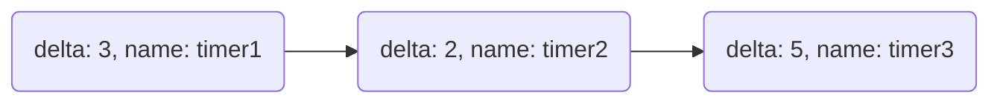

# Single Threaded Callback Execution

`safe_drive` makes use of the delta list, which was originally introduced by [Operating System Design, The Xinu Approach, Second Edition](https://xinu.cs.purdue.edu/)'s Chapter 13, for timer.
[selector.tla](./selector.tla) is a specification of the callback execution using the delta list.

## Prerequisites

- A timer will be reenabled after calling the callback function with at random delay.
- The clock is emulated by decreasing the delta of the head of the delta list.

## Variables

There are 2 global variables.

```tla+
\* list for timer
\* example: <<[delta |-> 3, name |-> "timer1"], [delta |-> 2, name |-> "timer2"]>>
delta_list = SetToSeq({[delta |-> random_num(0, DeltaRange), name |-> x]: x \in Timers});

\* events
wait_set = {};

\* tasks
running = {};
waiting = Tasks;
```

`delta_list` is a sequence of record containing `delta` and `name`.

For example, if the delta list contains following nodes,


then

- timer1 will be invoked after 3 clocks later.
- timer2 will be invoked after 5 = 3 + 2 clocks later.
- timer3 will be invoked after 10 = 3 + 2 + 5 clocks later.

Additionally, there are 3 sets to represents states of callback functions as follows.

- `running`: a set of processes running now
- `wait_set`: a set of processes which can be executed
- `waiting`: a set of processes waiting a event


## What do we check?

- Deadlock freedom
- Starvation freedom

The starvation freedom can be checked by using the temporal logic.
We use the expression as follows to check the starvation freedom.

```tla+
starvation_free == \A x \in (Timers \union Tasks):
    (((x \in {y.name: y \in ToSet(delta_list)}) \/ (x \in wait_set)) ~> <>(x \in running))
```

This is equivalent to

$$
\forall x \in (\mathrm{Timers} \cup \mathrm{Tasks})((x \in \lbrace y.\mathrm{name}\ |\ y \in \mathrm{delta\verb|_|list}\rbrace) \lor (x \in \mathrm{wait\verb|_|set}) \leadsto \lozenge (x \in \mathrm{running}))
$$

where

$$
\mathrm{Tasks} = \mathrm{Subscribers} \cap \mathrm{Servers} \cap \mathrm{Clients}.
$$
